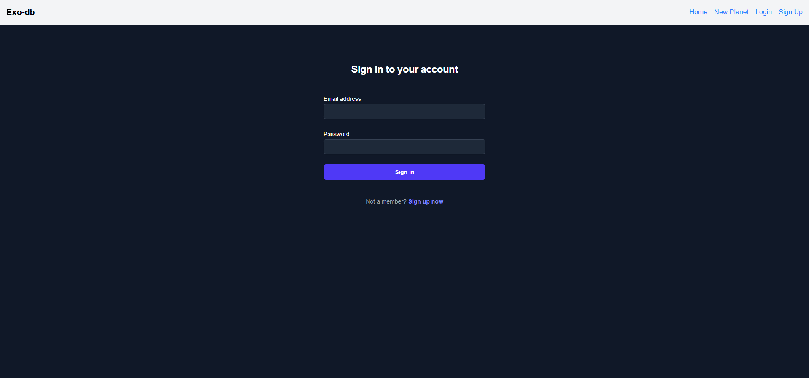

# Exoplanet database project NASA - Exo DB

## 1. How to run

You need to run both FE and BE servers in order to make the app run locally. The FE app is configured now to connect to the deployed back-end, but you can connect it to the local one by changing the API_BASE_URL address in the src/web/app/services/api.js file. You also need to add an instance of your MongoDB cluster in the env file

1. First, start the back-end

        cd ./src/api
        npm run dev

2. Now start the FE server

        cd ./src/web
        npm run dev

## 2. Architecture:
This project was flexible from the POV of the architecture and the technologies used, so I decided to use a classic client-server front-end architecture. The architecture for each component is as it follows:

1. Back-end
    - built on Express, with MongoDB for data persistance
    - decided NOT to use any ORM like Prisma, and relied on MongoDB classes due to the simplicity of the stored data
    - auth is built from scratch, in order to scale easily and handle social login we could use Firebase Auth
    - added a swagger UI for ease of use and possible integration with other applications
    - built and deployed as a sepparate Express app because usually NASA exposes all their data in APIs for scientific purpose, so I decided to do the same for this use case

2. Front-end
    - NextJS application
    - combines both client side rendered and server side rendered pages for SEO purposes:
        - Home page is client side rendered due to the real time filtering of the data
        - New planet page is also client side rendered
        - Exoplanet details page is server side rendered for SEO purposes, since it's a public page, with no Auth requirements, it should be indexed in Google searches, so decided to go with the SSR approach, in order to make it appear in the searches when someone is googling for a specific planet name

## 3. Deployment
The app is deployed using Railway, on a free plan. 

The API documentation is accessible at the following URL: https://exo-db-production.up.railway.app/api-docs/

The FE is available at the following URL: https://exo-db-production-07c2.up.railway.app/

Since a Free plan is used, the resources are limited, so if you see the app returning a 502 Bad Gateway or simply a 404 Not found response, please inform the author to restart the deployment containers, it is caused by the low specs of the Railway free plan.

Due to security and bandwidth issues, the app can only render images from https://commons.wikimedia.org/

## 4. How to test

1. Go to https://exo-db-production-07c2.up.railway.app/
2. You should only see the Home, Login and SignUp pages in the top navbar
3. Go to login
4. Either create a new account, or use the test account: test@test.com, pass: test
5. Now you should also have access to the New Page menu
6. From the Home page, clicking on a planet will open its details in the details page

Screenshots:

# AI usage disclosure:

Github Copilot running with Claude 3.5-Sonnet was used for the generation of the Swagger files and for some minor html layout changes

